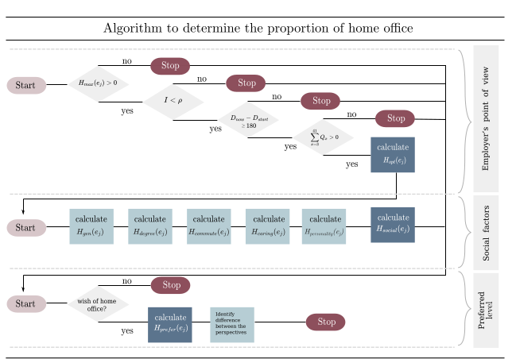

# How Much Home Office is Ideal? A Multi-Perspective Algorithm ([CHIWORK '23](https://www.chiwork.org/))

[Mark Colley*](https://scholar.google.de/citations?user=Kt5I7wYAAAAJ&hl=de&oi=ao), [Pascal Jansen*](https://scholar.google.de/citations?user=cR1_0-EAAAAJ&hl=en), Jennifer Jorina Matthiesen*, Hanne Hoberg, Carmen Regerand, Isabel Thiermann (*=equal contribution)


## Introduction to the Home Office Calculation
The COVID pandemic has made working from home necessary, and many employees want to continue doing so even after the pandemic. There are advantages and drawbacks to the home office trend from both employer and employee perspectives. Determining the ideal proportion of home office for each employee is important but there is a research gap in how to do so. This work presents an algorithm that considers multiple perspectives to determine the ideal proportion of home office, including the employer's view, demographic and social factors of the employee, and the employee's preferred proportion of home office. The algorithm combines findings from several studies and can identify discrepancies between these perspectives.


## HOMPA - Overview
we consider three different perspectives:

- The employer's point of view, denoted as `P_{ER}`
- Social factors, denoted as `P_{social}`
- The preferred proportion of home office, denoted as `P_{prefer}`

From the employer's perspective, we determine the maximum proportion of home office (`H_{max}`) based on the tasks executed and the ideal proportion of home office (`H_{opt}`), which also takes into account the proportion of interaction required for the particular tasks.

The factors of `P_{social}` and `P_{prefer}` are aggregated into `H_{social}` and `H_{prefer}` respectively.

We distinguish between an individual's and the company's total result for each perspective. Based on this, discrepancies between employers and employees and any need for discussion are identified.

The following image visualizes the algorithm.




### Employer's Point of View

#### Teleworkability-Index
$$H_{\text{max}}(e_j) = \sum_{i=9}^{16} T_i$$

#### Infrastructure
```math
H_{\text{max}_{\text{infra}}}(e) = 
\begin{cases}
\text{false } ,         & \text{if } I < \rho\\
H_{\text{max}}(e_j),               & \text{otherwise}
\end{cases}
```

#### Sense of Belonging to Company 
```math
H_{\text{max}_{\text{aff}}}(e_j) = 
\begin{cases}
\text{false } ,& \text{if } D_{\text{now}} - D_{\text{start}} \leq 180 \\
H_{\text{max}}(e_j),              & \text{otherwise}
\end{cases}
```

#### Task-Media-Fit Model
$$H_{\text{opt}}(e_j) = H_{\text{max}}(e_j) - \sum^{41}_{x = 3} Q_x$$


### Social Factors

#### Different Generations
$$H_{\text{gen}}(e_j) =
\begin{cases}
48 ,& \text{if } Y_{\text{birth}} \in \{1946,1964\} \\
50 ,& \text{if }  Y_{\text{birth}} \in \{1965,1980\} \\
44 ,& \text{if }  Y_{\text{birth}} \in \{1981,1994\} \\
28,              & \text{otherwise, see Gen Z}
\end{cases}$$

#### Education 
$$        H_{\text{degree}}(e_j) =
        \begin{cases}
            48 ,& \text{if } L_{edu} =  \text{"high school"}\\
            17 ,& \text{if } L_{edu}  =\text{"middle school"} \\
            8,              & \text{otherwise} 
        \end{cases}$$

#### Commute Time
$$        H_{commute}(e_j) =
         \begin{cases}
            46 ,& \text{if } t_{\text{commute}}  > 40\\
            2.3 * t_{\text{commute}} -46,& \text{if } t_{\text{commute}}  \in [20, 40]\\
            0 ,              & \text{otherwise} 
        \end{cases}$$

#### Caring Responsibility
$$        H_{caring}(e_j) =
        \begin{cases}
            56.1 ,& \text{if } C \text{ and } G = \text{f} \\
            52 ,& \text{if }  C \text{ and } G = \text{m} \\
            50,              & \text{otherwise} 
        \end{cases}$$

#### Personality Factors

##### Openness
$$        H_{\text{OPN}}(e_j) =
        \begin{cases}
            1.2 ,& \text{if }  \text{Openness} \in [2,8] \\
            6.1,              & \text{otherwise} 
        \end{cases}$$
        
##### Neuroticism
$$       H_{\text{NCM}}(e_j) =
        \begin{cases}
            6.3 ,& \text{if }  \text{Neuroticism} \in [2,7] \\
            2.2,              & \text{otherwise} 
        \end{cases}$$

##### Perseverance and Passion
$$        H_{\text{PP}}(e_j) =
        \begin{cases}
            1.7 ,& \text{if } \text{Perseverance and passion} \in [1,3] \\
            6.5,              & \text{otherwise} 
        \end{cases}$$


Combined: $$H_{ \text{personality}}(e_j) = \frac{H_{\text{OPN}}(e_j) + H_{\text{NCM}}(e_j) + H_{\text{PP}}(e_j)}{{6.1+6.3+6.5}} * 100$$


### Employee Requests
$$H_{prefer}(e_j) = \left( \frac{H_{wish}(e_j)}{5} \right)	 * 100$$
